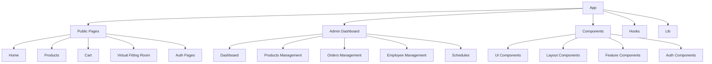

# Queens E-commerce Platform

A modern e-commerce platform built with Next.js 13, featuring a virtual fitting room, admin dashboard, and responsive design.

## Tech Stack

- **Framework:** Next.js 13.5
- **Language:** TypeScript
- **Styling:** Tailwind CSS
- **UI Components:** 
  - Radix UI Primitives
  - Shadcn UI
- **Forms:** React Hook Form with Zod validation
- **State Management:** React Hooks
- **Charts:** Recharts
- **Carousel:** Embla Carousel
- **Date Handling:** date-fns
- **Theme:** next-themes for dark/light mode

## Project Structure



## Features

- 🛍️ **E-commerce Functionality**
  - Product browsing and filtering
  - Shopping cart management
  - Checkout process
  
- 👔 **Virtual Fitting Room**
  - Try clothes virtually
  - Size recommendations
  
- 🔐 **Authentication**
  - User registration
  - Login system
  - Password recovery
  
- 📊 **Admin Dashboard**
  - Product management
  - Order tracking
  - Employee management
  - Schedule management
  
- 🎨 **UI/UX**
  - Responsive design
  - Dark/Light mode
  - Modern UI components
  - Interactive charts

## Directory Structure

```
queens/
├── app/                    # Next.js 13 app directory
│   ├── admin/             # Admin dashboard routes
│   ├── productos/         # Products routes
│   ├── carrito/          # Shopping cart routes
│   └── vestidor-virtual/ # Virtual fitting room
├── components/
│   ├── ui/               # Reusable UI components
│   ├── auth/             # Authentication components
│   ├── layout/           # Layout components
│   └── home/             # Homepage components
├── hooks/                # Custom React hooks
├── lib/                  # Utility functions
└── public/              # Static assets
```

## Getting Started

### Prerequisites

- Node.js 16.8 or later
- npm or yarn

### Installation

1. Clone the repository:
```bash
git clone [repository-url]
cd queens
```

2. Install dependencies:
```bash
npm install
# or
yarn install
```

3. Set up environment variables:
```bash
cp .env.example .env.local
```

4. Start the development server:
```bash
npm run dev
# or
yarn dev
```

The application will be available at `http://localhost:3000`

## Available Scripts

- `npm run dev` - Run development server
- `npm run build` - Build for production
- `npm run start` - Start production server
- `npm run lint` - Run ESLint

## Contributing

1. Fork the repository
2. Create your feature branch: `git checkout -b feature/my-new-feature`
3. Commit your changes: `git commit -m 'Add some feature'`
4. Push to the branch: `git push origin feature/my-new-feature`
5. Submit a pull request

## License

This project is licensed under the MIT License - see the LICENSE file for details.
